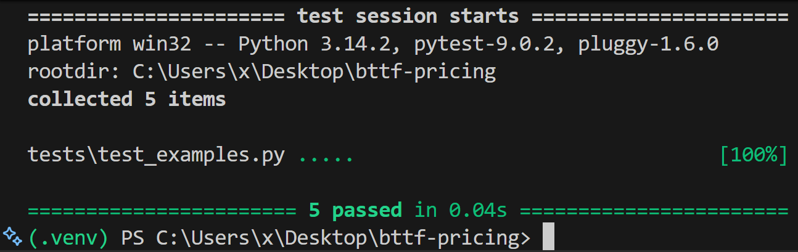

# SAGA_MOVIES

Petit programme de commande qui calcule le prix total d’un panier de films
selon des règles de réduction spécifiques à la saga **Back to the Future**.

Le panier est fourni sous forme de texte (un film par ligne) et le programme
affiche le prix total correspondant.

---

## Règles de tarification

- Un DVD **Back to the Future** coûte **15 €**
- Tout autre film coûte **20 €**
- Une remise s’applique **uniquement** sur les DVDs *Back to the Future* :
  - **2 volets distincts** → **10 %**
  - **3 volets distincts** → **20 %**
- La remise dépend du **nombre de volets différents**, pas de la quantité achetée

---

## Format d’entrée

- Un film par ligne
- Le texte est lu depuis l’entrée standard (stdin)

Exemple :

Back to the Future 1

Back to the Future 2

La chèvre


---

## Exécution du programme

### Pré-requis
- Python **3.10+**

### Lancer le programme
```bash
python main.py
```
Puis coller le panier dans le terminal et valider.

Ou via redirection :
``` bash
python main.py < basket.txt
```
Exemple

Entrée :

Back to the Future 1
Back to the Future 3


Sortie :

27

## Tests unitaires

Les tests unitaires couvrent l’ensemble des exemples fournis dans l’énoncé.

### Lancer les tests :

pytest


### Résultat attendu :



## Structure du projet
``` BASH
SAGA_MOVIES/
├── bttf/              # logique métier
│   ├── parser.py
│   ├── pricing.py
│   └── calculator.py
├── tests/             # tests unitaires
│   ├── conftest.py
│   └── test_examples.py
├── main.py            # point d’entrée CLI
├── README.md
└── .gitignore
```
## Notes

- BTTF signifie Back to the Future

- Aucun frontend par choix : l’objectif est de se concentrer sur la logique métier

- Le code est volontairement simple, lisible et facilement testable

